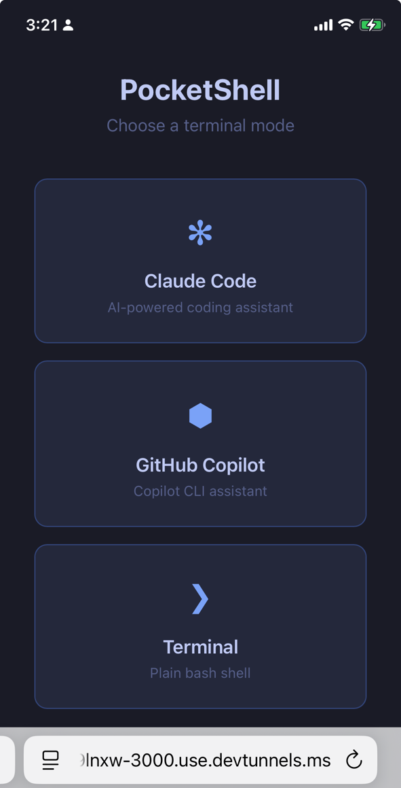

# PocketShell

[](LICENSE)

**Your terminal, anywhere.** Run Claude Code, GitHub Copilot, or a plain bash shell from any browser — desktop or mobile.

<!-- If you have a landing page screenshot, uncomment:

-->

## Why PocketShell?

Sometimes you need a terminal on a device that doesn't have one — your phone, a tablet, a borrowed laptop. PocketShell gives you a full terminal experience through the browser, with dedicated support for AI coding assistants.

| Mode | What you get |
|------|-------------|
| **Claude Code** | Anthropic's AI coding assistant with a mobile-friendly reader view |
| **GitHub Copilot** | GitHub's CLI assistant in your browser |
| **Terminal** | Plain bash shell — use it for anything |

Each mode runs its own independent PTY session. Open all three in separate tabs if you want.

## Quickstart

```bash
git clone https://github.com/tarsnet/pocketshell.git
cd pocketshell
npm run setup    # checks prerequisites, installs dependencies
npm start        # starts server at http://localhost:3000
```

Open `http://localhost:3000` — you'll see the landing page. Pick a mode and go.

## Features

- **Three terminal modes** — Claude Code, GitHub Copilot, or plain bash, each with its own PTY
- **Desktop & Mobile UIs** — Full xterm.js terminal for desktop, chat-style reader view for mobile
- **Per-mode reader parsers** — Claude, Copilot, and terminal output each parsed into styled segments
- **Real-time streaming** — WebSocket-based PTY with replay buffer for reconnecting clients
- **Secure remote access** — Password + TOTP (Google Authenticator), rate-limited login, signed cookies
- **One-command tunnel** — Microsoft Dev Tunnels integration for persistent HTTPS URLs
- **No build step** — Pure client-side JavaScript, no bundler required

## URL Structure

| URL | Description |
|-----|-------------|
| `/` | Landing page — pick a mode |
| `/desktop/claude` | Desktop terminal running Claude Code |
| `/desktop/copilot` | Desktop terminal running GitHub Copilot |
| `/desktop/terminal` | Desktop terminal running bash |
| `/mobile/claude` | Mobile reader view running Claude Code |
| `/mobile/copilot` | Mobile reader view running GitHub Copilot |
| `/mobile/terminal` | Mobile reader view running bash |

The landing page auto-detects your device and links to the right view.

## Architecture

```
Browser (Desktop / Mobile)
    |
    |-- /desktop/:mode --> xterm.js full terminal
    |-- /mobile/:mode  --> reader view + hidden xterm.js
    |
    +-- WebSocket /ws/:mode
            |
            v
        Express Server
            |
            +-- PtySession (per mode, lazy-spawned)
            |       |-- node-pty --> claude / copilot / bash
            |       |-- Replay buffer (100KB)
            |       +-- Broadcast to connected clients
            |
            +-- Auth Middleware (password + TOTP)
            +-- Optional: Dev Tunnel (HTTPS)
```

## Usage

### Local (with auth — default)

```bash
./pocketshell.sh start              # or: npm start
```

### Local (no auth — trusted network)

```bash
./pocketshell.sh start --local-noauth   # or: npm run start:noauth
```

### Remote access (server + tunnel)

```bash
./pocketshell.sh start --remote    # or: npm run start:remote
```

Starts the server and a Dev Tunnel together. Prints the HTTPS URL. Ctrl+C stops both.

Requires [Dev Tunnels CLI](https://aka.ms/DevTunnelCliInstall) — one-time setup:

```bash
curl -sL https://aka.ms/DevTunnelCliInstall | bash
devtunnel user login -g -d
```

### Stop

```bash
./pocketshell.sh stop
```

### Custom port

```bash
node server.js --port 8080
# or: PORT=8080 npm start
```

## CLI Reference

```
./pocketshell.sh setup                 # Check prerequisites, install deps
./pocketshell.sh start                 # Start locally with auth (default)
./pocketshell.sh start --local         # Same as above
./pocketshell.sh start --remote        # Start server + tunnel
./pocketshell.sh start --local-noauth  # Start without auth
./pocketshell.sh stop                  # Stop server and tunnel
./pocketshell.sh help                  # Show usage
```

## npm scripts

| Script | Description |
|--------|-------------|
| `npm start` | Start server locally (with auth) |
| `npm run setup` | Check prerequisites and install deps |
| `npm run start:remote` | Start server + tunnel |
| `npm run start:noauth` | Start server without auth |

## Platform Support

| Platform | Status | Notes |
|----------|--------|-------|
| macOS | Full support | Works natively |
| Linux | Full support | Works natively |
| WSL | Full support | CLI tools must be installed inside WSL |
| Windows (native) | Partial | Needs Node.js + build tools for node-pty |

## Security

| Layer | Detail |
|-------|--------|
| HTTPS | Dev Tunnels provides TLS encryption |
| Password | PBKDF2-hashed (100K iterations, SHA-512, random salt) |
| TOTP | Google Authenticator compatible, 30-second rotating codes |
| Rate Limiting | 5 failed attempts per IP, 15-minute lockout |
| Session Cookie | HMAC-SHA256 signed, httpOnly, sameSite strict, secure (auto-detected), 24h expiry |
| WebSocket Auth | Unauthenticated upgrade requests rejected |
| Config File | `.auth.json` written with mode 0600 |

## File Structure

```
pocketshell/
  pocketshell.sh           # CLI entrypoint
  prerequisites.sh         # Dependency checker
  server.js                # Express + WebSocket + multi-mode PTY server
  auth.js                  # Authentication (password, TOTP, sessions)
  package.json
  public/
    index.html / index.css # Landing page (mode picker)
    login.html             # Setup/login page
    desktop.html/.js/.css  # Desktop terminal UI
    mobile.html/.js/.css   # Mobile terminal + reader UI
    shared.js              # Shared terminal config, WebSocket, theme
    reader-parser.js       # Claude CLI conversation parser
    copilot-parser.js      # Copilot CLI conversation parser
    terminal-parser.js     # Plain terminal conversation parser
```

## Resetting Authentication

```bash
rm .auth.json
npm start
# Setup page will appear again
```

## License

MIT License — free for personal and commercial use. See [LICENSE](LICENSE).
